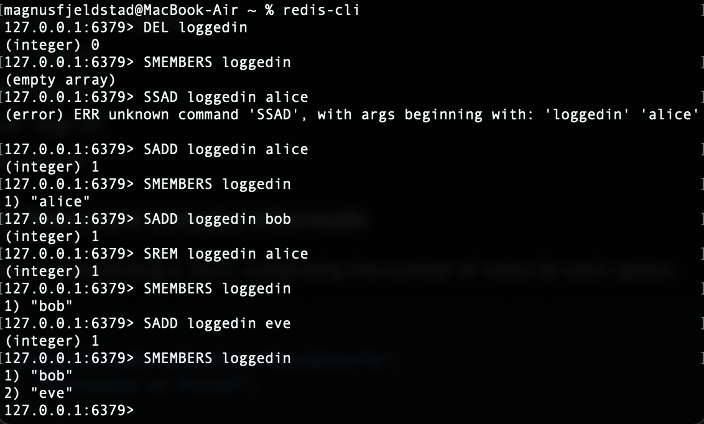
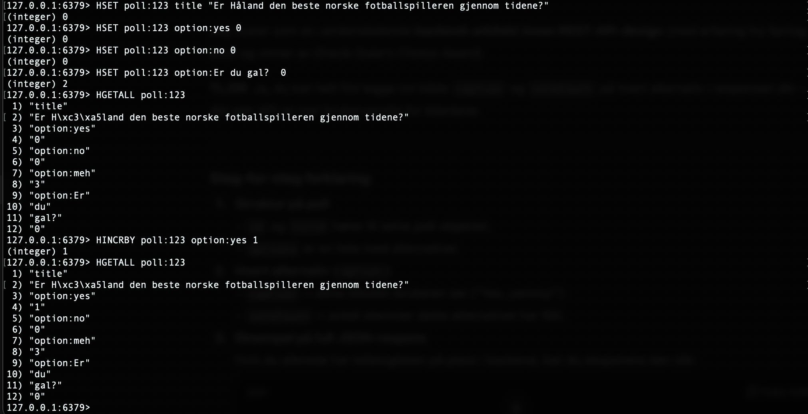

# DAT250 Experiment Assignment 5

## Introduction

In this assignment, I worked with Redis (NoSQL database) to understand its role as a cache, a simple database, and how
it integrates into a Java backend. The main focus was on using Redis as a cache for poll votes, replacing expensive SQL
aggregation queries with faster in-memory lookups.

---

## Installation

I installed Redis locally and verified the setup using the `redis-cli`.

- `PING` returned `PONG` as expected.
- I tested basic operations such as `SET` / `GET` and experimented with expiration (`EXPIRE`, `TTL`).

---

## CLI Experiments

I explored different Redis datatypes:

- **Sets**: used to keep track of logged-in users.  
  

- **Hashes**: used to represent structured objects such as poll options and vote counts.  
  

I also tried increment operations (`HINCRBY`) to update vote counts efficiently without replacing the entire object.

---

## Java Client (Jedis)

I integrated the Jedis library into my Java project.

- Connected via `UnifiedJedis jedis = new UnifiedJedis("redis://localhost:6379");`
- Reproduced the CLI experiments programmatically.
- Created a `PollVoteCache` class to store and retrieve poll vote counts.

This allowed me to cache aggregated poll results and retrieve them quickly.

---

## Cache Implementation

The cache was designed to speed up access to poll vote counts:

1. On retrieval, the application checks Redis first.
2. If cached, the vote counts are returned immediately.
3. If not cached, the SQL query aggregates the data from the database, then the result is stored in Redis for future
   requests.
4. When a new vote is added, the corresponding cache entry can be updated or invalidated.

Redis Hashes were used for the denormalized poll data, making it possible to increment votes efficiently with `HINCRBY`.

5. [Cache implementation](https://github.com/Magnus-Fjeldstad/poll-app/blob/main/pollapp/src/main/java/com/poll/pollapp/cache/PollVoteCache.java)

---

## Technical Problems

- Installation and CLI tests worked without major issues.
- One test I created did not behave as expected. After investigation, I suspect the issue is related to my API
  implementation rather than the Redis cache itself.

- [Redis client test file](https://github.com/Magnus-Fjeldstad/poll-app/blob/main/pollapp/src/test/http/redis-client-test.http)

---

## Pending Issues

- Some edge cases around cache invalidation could be improved (e.g., ensuring consistency when multiple votes arrive at
  the same time).
- Did not explore advanced features such as Redis JSON or Redis cluster.

---

## Conclusion

This exercise gave me practical experience with Redis both as a CLI tool and as an integrated part of a Java
application. I successfully implemented a cache for poll votes, which reduces database load and improves response time.
Redis proved to be a flexible tool that can act as both a cache and a database.

